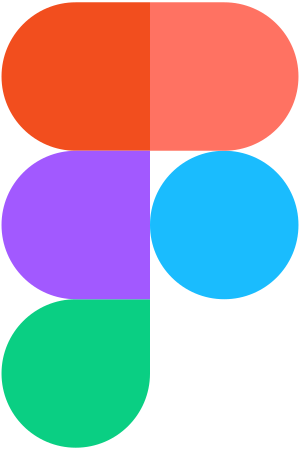

  <h1>Hello there! I'm Anirudh 👋</h1>  
    
  <h3>⚡ Anirudh Chimpidi | Frontend Developer | UI/UX Designer</h3>
  <i>"Making pixels vue in 420p"</i>

## Glad to see you here!

I'm Anirudh, currently a Computer Science undergrad at Mahindra University, Hyderabad.

They call me Andro on telegram and Tron on discord. You can call me either, it's the same for me.

I enjoy creating user interfaces and designs whenever I have the opportunity. I can get quite nitpicky when it comes to details due my habit of attaining pixel perfection. I do need a lot of music at max volume to concentrate.

I'm proficient at Frontend webdev and appdev (preferably native Android), as well as I do a pretty good job at User Interfaces of any apps or websites I make. Currently I have a solid 4 years experience with VueJS as a webdev framework and Figma as my prototyping tool. I've just gotten hands on Procreate to hone the graphic designer in me as well, but I guess that's for another time.

I have an ongoing custom ROM project based on AOSP, [Project Fluid](https://github.com/Project-Fluid). I Co Founded it with 2 other very cool guys, and currently manage the UI/UX as well as the project website live at [projectfluid.org](https://projectfluid.org). Would totally recommend giving a look once, pretty proud of this one.

When I'm free I usually spend time playing games, and very rarely do I do programming, usually in C++ or Kotlin.

## 🌌 Work I do at leisure

- 💻 Making designs and learning new skills
- 🎮 Playing video games
- 🎵 Blasting music into ears

## ⚙️ Tech Stack

 &nbsp; &nbsp;
 &nbsp; &nbsp;
 &nbsp; &nbsp;
 &nbsp; &nbsp;
 &nbsp; &nbsp;
 &nbsp; &nbsp;
